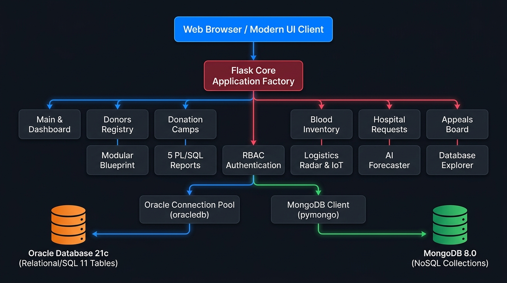
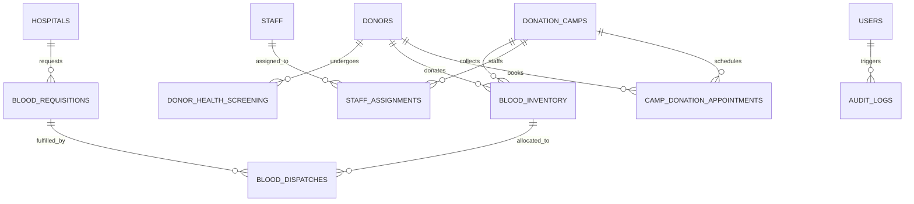

# 🩸 LifeLine Connect: Comprehensive Project Master Dossier (A to Z)
**HDSE Data Management 2 Coursework Project**  
*National Blood Transfusion Service (NBTS) Sri Lanka — Hybrid Database Web Platform*

---

## 📑 Table of Contents
1. [Executive Summary & Project Vision](#1-executive-summary--project-vision)
2. [End-to-End System Architecture](#2-end-to-end-system-architecture)
3. [Oracle 21c Relational Database Layer](#3-oracle-21c-relational-database-layer)
   - 3.1 [Entity-Relationship Design & Normalization](#31-entity-relationship-design--normalization)
   - 3.2 [Schema Specification & Constraints](#32-schema-specification--constraints)
   - 3.3 [PL/SQL Stored Procedures & Functions (FEFO Engine)](#33-plsql-stored-procedures--functions-fefo-engine)
   - 3.4 [Database Triggers & Audit Architecture](#34-database-triggers--audit-architecture)
   - 3.5 [The 5 PL/SQL Business Intelligence Reports](#35-the-5-plsql-business-intelligence-reports)
4. [MongoDB 8.0 NoSQL Database Layer](#4-mongodb-80-nosql-database-layer)
   - 4.1 [Schema-Flexible Collections Design](#41-schema-flexible-collections-design)
   - 4.2 [PyMongo Aggregations & Query Pipelines](#42-pymongo-aggregations--query-pipelines)
5. [Python (Flask) MVC Web Application](#5-python-flask-mvc-web-application)
   - 5.1 [Architectural Pattern & Blueprint Topology](#51-architectural-pattern--blueprint-topology)
   - 5.2 [Dual-Database Connector Layer](#52-dual-database-connector-layer)
   - 5.3 [Complete Controller & Route Directory](#53-complete-controller--route-directory)
6. [Advanced Enterprise Features](#6-advanced-enterprise-features)
   - 6.1 [🗺️ Geospatial Logistics Radar & Sri Lanka Dispatch Map](#61-geospatial-logistics-radar--sri-lanka-dispatch-map)
   - 6.2 [❄️ IoT Cold-Chain Storage & Sensor Telemetry Center](#62-iot-cold-chain-storage--sensor-telemetry-center)
   - 6.3 [🤖 AI Clinical Shortage Forecaster & Smart Donor Summon](#63-ai-clinical-shortage-forecaster--smart-donor-summon)
   - 6.4 [🗄️ Live Database Explorer & Interactive SQL Studio](#64-live-database-explorer--interactive-sql-studio)
   - 6.5 [🪪 Digital Holographic Donor Pass with Dynamic QR](#65-digital-holographic-donor-pass-with-dynamic-qr)
7. [Role-Based Access Control (RBAC) & Security](#7-role-based-access-control-rbac--security)
8. [Automated Verification & 37-Test Suite](#8-automated-verification--37-test-suite)
9. [Complete Codebase Directory Breakdown](#9-complete-codebase-directory-breakdown)
10. [Step-by-Step Deployment & Evaluation Guide](#10-step-by-step-deployment--evaluation-guide)

---

## 1. Executive Summary & Project Vision

**LifeLine Connect** is an enterprise-grade, hybrid database clinical management platform engineered specifically for the **National Blood Transfusion Service (NBTS) Sri Lanka** (*ජාතික රුධිර පාරවිලයන සේවය*). 

Blood banking operations require balancing two fundamentally different data paradigms:
1. **High-Integrity ACID Relational Data**: Clinical donor registries, strict eligibility screening, blood testing, inventory expiry tracking via **First-Expiry-First-Out (FEFO)**, emergency hospital requisitions, and audit logs.
2. **Dynamic, Schema-Flexible Unstructured Data**: Emergency community appeals, crowdsourced donor camp feedback/star ratings, rich medical campaign guidelines, and real-time discussion threads.

To solve this, LifeLine Connect combines **Oracle Database 21c (Relational/SQL)** and **MongoDB 8.0 (Document NoSQL)** beneath a modern **Python Flask Model-View-Controller (MVC)** application. The system is localized to Sri Lanka with real hospital coordinates, NIC validation, and emergency logistical tracking.

```
       +-----------------------------------------------------------+
       |                  LIFELINE CONNECT (WEB UI)                |
       |  - Executive Dashboard       - Donor Holographic Passes   |
       |  - Logistics Radar & IoT     - AI Shortage Forecaster     |
       |  - Hospital Requisitions     - Live Database Explorer     |
       +-----------------------------+-----------------------------+
                                     |
                                     v
                       +---------------------------+
                       |   FLASK MVC APPLICATION   |
                       |  (11 Modular Blueprints)  |
                       +-------------+-------------+
                                     |
               +---------------------+---------------------+
               |                                           |
               v                                           v
+-------------------------------+           +-------------------------------+
|     ORACLE DATABASE 21c       |           |          MONGODB 8.0          |
|  - 11 Relational Tables       |           |  - 3 Document Collections     |
|  - ACID Clinical Integrity    |           |  - Aggregation Pipelines      |
|  - PL/SQL Stored Procedures   |           |  - Full-Text Search Indices   |
|  - FEFO Inventory Fulfillment |           |  - Unstructured Media Banners |
|  - 5 BI Analytics Reports     |           |  - Multi-Criteria Reviews     |
+-------------------------------+           +-------------------------------+
```

---

## 2. End-to-End System Architecture

The architecture adheres to clean separation of concerns across clinical, data, and presentation tiers:



```mermaid
graph TD
    Client[Web Browser / Modern UI Client] -->|HTTP / REST API| FlaskCore[Flask Application Factory]
    
    subgraph Controller Layer (11 Blueprints)
        FlaskCore --> MainBP[Main / Dashboard]
        FlaskCore --> DonorBP[Donors & Screening]
        FlaskCore --> CampBP[Donation Camps]
        FlaskCore --> InvBP[Blood Inventory & Intake]
        FlaskCore --> HospBP[Hospitals & Requisitions]
        FlaskCore --> AppealBP[Emergency Appeals]
        FlaskCore --> ReportBP[PL/SQL Business Reports]
        FlaskCore --> AuthBP[RBAC Authentication]
        FlaskCore --> LogistBP[Geospatial Radar & IoT]
        FlaskCore --> AI_BP[AI Forecaster & Summon]
        FlaskCore --> DB_BP[Oracle & Mongo Explorer]
    end

    subgraph Data Access Layer
        DonorBP & InvBP & HospBP & ReportBP & DB_BP --> OraclePool[Oracle Connection Pool / oracledb]
        CampBP & AppealBP & DB_BP --> MongoConn[MongoDB Client / pymongo]
    end

    subgraph Persistence Layer
        OraclePool --> OracleDB[(Oracle Database 21c XE)]
        MongoConn --> MongoDB[(MongoDB 8.0 Local)]
    end
```

---

## 3. Oracle 21c Relational Database Layer

### 3.1 Entity-Relationship Design & Normalization
The relational schema satisfies **Third Normal Form (3NF)** and **Boyce-Codd Normal Form (BCNF)** to eliminate redundancy and enforce referential integrity across the clinical donation pipeline.



### 3.2 Schema Specification & Constraints (`01_schema.sql`)
The relational schema comprises **11 core tables**:

1. **`DONORS`**: Primary donor registry storing unique National Identity Cards (`nic`), blood groups (`A+`, `A-`, `B+`, `B-`, `AB+`, `AB-`, `O+`, `O-`), contact data, and active eligibility status.
2. **`DONOR_HEALTH_SCREENING`**: Pre-donation clinical records storing hemoglobin (g/dL), systolic/diastolic blood pressure, pulse, weight, deferral reasons, and examining medical staff IDs.
3. **`DONATION_CAMPS`**: Mobile and static donation venues across Sri Lanka with target units, operational dates, venue coordinates, and status (`PLANNED`, `ACTIVE`, `COMPLETED`, `CANCELLED`).
4. **`BLOOD_INVENTORY`**: Individual cryo-stored blood units tracking component types (`WHOLE_BLOOD`, `RED_BLOOD_CELLS`, `PLATELETS`, `FRESH_FROZEN_PLASMA`), collection dates, volume (mL), storage bay locations, status (`AVAILABLE`, `RESERVED`, `DISPATCHED`, `EXPIRED`, `DISCARDED`), and strict expiration dates.
5. **`HOSPITALS`**: Accredited Sri Lankan health institutions (e.g., NHSL Colombo, Lady Ridgeway, Kandy General, Karapitiya Teaching Hospital) with licensing codes, emergency contact points, and GPS coordinates.
6. **`BLOOD_REQUISITIONS`**: Clinical blood purchase/emergency orders categorized by urgency (`ROUTINE`, `URGENT`, `STAT_EMERGENCY`) and status (`PENDING`, `PARTIALLY_FULFILLED`, `FULFILLED`, `CANCELLED`).
7. **`BLOOD_DISPATCHES`**: Cold-chain transit records binding specific inventory units to hospital requests with courier vehicle numbers and departure/arrival timestamps.
8. **`STAFF`**: NBTS medical officers, phlebotomists, and administrative personnel with medical license numbers.
9. **`STAFF_ASSIGNMENTS`**: Shift logs binding staff to mobile camps with hours worked and attendance verification.
10. **`CAMP_DONATION_APPOINTMENTS`**: Pre-booked donor time slots.
11. **`AUDIT_LOGS`**: Immutable audit trails recording entity mutations, user IDs, IP addresses, and before/after values.

### 3.3 PL/SQL Stored Procedures & Functions (`03_procedures_functions.sql`)

* **`sp_register_donor`**: Registers donors with NIC uniqueness validation and birthdate age validation (18–65 years).
* **`sp_record_health_screening`**: Evaluates hemoglobin ($\ge 12.5\text{ g/dL}$), systolic BP ($100–140\text{ mmHg}$), diastolic BP ($60–90\text{ mmHg}$), and weight ($\ge 50\text{ kg}$). Automatically marks donor eligible or deferred.
* **`sp_intake_blood_donation`**: Atomically records screening, generates unit barcode, calculates expiration date based on component shelf-life (42 days for RBC, 5 days for Platelets, 365 days for Plasma), and updates donor last donation date.
* **`sp_fulfill_hospital_request` (FEFO Engine)**: 
  - Implements **First-Expiry-First-Out (FEFO)** clinical dispatch.
  - Queries available matching units ordered by `expiry_date ASC`.
  - Atomically marks unit `DISPATCHED`, generates dispatch manifest, and updates requisition status.
* **`fn_check_donor_eligibility`**: Deterministic PL/SQL function checking 90-day male / 120-day female cooldown periods and active medical deferrals.

### 3.4 Database Triggers (`04_triggers.sql`)
* **`trg_audit_blood_inventory`**: Automated AFTER UPDATE trigger logging unit state transitions (`AVAILABLE` $\to$ `DISPATCHED` or `EXPIRED`) into `AUDIT_LOGS`.
* **`trg_update_camp_stats`**: Automatically tallies collected units directly onto camp summary records upon donation intake.
* **`trg_prevent_expired_dispatch`**: BEFORE INSERT trigger on `BLOOD_DISPATCHES` raising an application error (`ORA-20001`) if an operator attempts to dispatch an expired unit.

---

### 3.5 The 5 PL/SQL Business Intelligence Reports (`05_business_reports.sql`)

| # | Function Name | Purpose | Key Metrics / Parameters |
| :--- | :--- | :--- | :--- |
| **1** | `fn_report_camp_collections` | Total Units Collected Across Camps by Blood Group | Aggregates collection counts by camp venue, district, and blood group (`A+`, `O-`, etc.) with cross-tabulation. |
| **2** | `fn_report_expiring_inventory` | Blood Inventory Levels & Expiring Stock | Takes `p_days_ahead` (default 7 days). Identifies critical units nearing shelf-life limit, storage bay, and component type. |
| **3** | `fn_report_donor_history` | Individual Donor Eligibility & Clinical Dossier | Takes `p_donor_id`. Summarizes lifetime donations, volume donated, deferral incidents, and date of next eligibility. |
| **4** | `fn_report_hospital_fulfillment` | Hospital Demand vs. Fulfillment Efficiency | Measures hospital order volume, fulfillment speed, shortage gaps, and STAT emergency response rates. |
| **5** | `fn_report_staff_workload` | Staff & Volunteer Deployment Workload | Tracks clinical shifts, hours worked, attendance compliance percentage, and camp coverage per medical officer. |

---

## 4. MongoDB 8.0 NoSQL Database Layer

MongoDB handles unstructured, collaborative, and media-rich data that does not fit into relational tables.

### 4.1 Schema-Flexible Collections Design (`01_mongo_seed.py`)

#### 1. Collection: `emergency_appeals`
Used for real-time blood broadcasts and community responses:
```json
{
  "_id": "ObjectId(...)",
  "appeal_id": "APP-2026-001",
  "blood_group": "O-",
  "component": "RED_BLOOD_CELLS",
  "units_required": 4,
  "units_pledged": 3,
  "hospital_name": "National Hospital of Sri Lanka (NHSL)",
  "urgency_level": "CRITICAL",
  "headline": "Urgent O- Negative Needed for Emergency Surgery",
  "case_summary": "Multiple trauma patient admitted to Colombo Trauma Center...",
  "status": "OPEN",
  "tags": ["trauma", "urgent", "colombo", "rare_blood"],
  "pledges": [
    {
      "donor_name": "Kasun Fernando",
      "contact": "+94 77 123 4567",
      "pledged_at": "2026-09-04T08:30:00Z",
      "eta_minutes": 25
    }
  ],
  "created_at": "2026-09-04T07:00:00Z"
}
```

#### 2. Collection: `camp_feedback`
Stores dimensional donor satisfaction ratings:
```json
{
  "camp_id": 2001,
  "camp_name": "Viharamahadevi Park Mega Blood Drive",
  "donor_id": 1001,
  "ratings": {
    "staff_professionalism": 5,
    "cleanliness_hygiene": 5,
    "waiting_time": 4,
    "refreshments_recovery": 5,
    "overall": 4.8
  },
  "review_text": "Extremely smooth process! Medical officers were patient and supportive.",
  "submitted_at": "2026-09-04T11:00:00Z"
}
```

#### 3. Collection: `campaign_media`
Educational banners, blood drives, and donor preparation guidelines with tags and file URLs.

### 4.2 PyMongo Aggregations & Query Pipelines (`02_mongo_queries.py`)

* **Top-Rated Camps Pipeline**:
  ```python
  pipeline = [
      {"$group": {
          "_id": "$camp_id",
          "camp_name": {"$first": "$camp_name"},
          "avg_rating": {"$avg": "$ratings.overall"},
          "review_count": {"$sum": 1},
          "cleanliness_avg": {"$avg": "$ratings.cleanliness_hygiene"}
      }},
      {"$match": {"review_count": {"$gte": 1}}},
      {"$sort": {"avg_rating": -1}}
  ]
  ```
* **Full-Text Emergency Search**: Multi-field text index across `headline`, `case_summary`, and `tags` with blood group filtering.

---

## 5. Python (Flask) MVC Web Application

### 5.1 Architectural Pattern & Blueprint Topology
Built using the **Application Factory** pattern in `app/__init__.py`. Routes are divided into 11 distinct Blueprints:

```
app/
├── __init__.py               # App factory, DB pool initialization, template filters
├── config.py                 # Oracle, Mongo, and Flask secret configurations
├── controllers/              # MVC Controller Blueprints
│   ├── main_controller.py       # Home dashboard metrics
│   ├── donor_controller.py      # Donor registry, screening, pass view
│   ├── camp_controller.py       # Camp schedules, reviews, top-rated
│   ├── inventory_controller.py # Stock matrix, intake, expiration warnings
│   ├── hospital_controller.py  # Requisitions, FEFO dispatch, delivery
│   ├── appeal_controller.py    # MongoDB emergency appeals & broadcast
│   ├── report_controller.py    # PL/SQL 5 reports runner
│   ├── auth_controller.py      # Login, registration, session management
│   ├── logistics_controller.py # Geospatial radar map & IoT telemetry
│   ├── analytics_controller.py # AI shortage forecaster & donor summon
│   └── database_controller.py  # Live Oracle SQL studio & Mongo inspector
├── models/                   # Dual-Database Data Access Layer
│   ├── oracle_db.py             # Oracle Connection Pool management
│   ├── mongo_db.py              # PyMongo client management
│   ├── donor_model.py           # SQL queries for Donors & Screening
│   ├── camp_model.py            # SQL queries for Camps & Appointments
│   ├── inventory_model.py       # SQL queries for Blood Inventory & FEFO
│   ├── hospital_model.py        # SQL queries for Requisitions & Dispatches
│   ├── report_model.py          # PL/SQL function executions (Ref cursors)
│   ├── user_model.py            # User authentication queries
│   └── nosql_model.py           # MongoDB aggregation & query wrappers
├── static/                   # Static Frontend Assets
│   ├── css/style.css            # Dark mode clinical CSS design system
│   └── js/main.js               # Audio synthesis, modals, search palette
└── templates/                # Jinja2 Modular HTML Views
```

---

## 6. Advanced Enterprise Features

### 6.1 🗺️ Geospatial Logistics Radar & Sri Lanka Dispatch Map
* **URL**: [`/logistics/`](http://127.0.0.1:5000/logistics/)
* **Cartography**: Keyless high-contrast **Esri World Dark Gray Canvas** and OpenStreetMap tiles.
* **Geospatial Centering**: Centered on Colombo, Sri Lanka (`[6.9147, 79.8778]`), displaying:
  - 🩸 **National Blood Centre (NBTS Sri Lanka)**, Narahenpita
  - 🏥 **National Hospital of Sri Lanka (NHSL)**, Colombo 10
  - 🏥 **Lady Ridgeway Hospital for Children (LRH)**, Borella
  - 🏥 **Colombo South Teaching Hospital**, Kalubowila
  - 🏥 **Teaching Hospital Karapitiya**, Galle
  - 🏥 **National Hospital Kandy**, Peradeniya
* **Live Couriers**: Real-time pulsing markers displaying speed, cargo temperature, and destination ETA.

### 6.2 ❄️ IoT Cold-Chain Storage & Sensor Telemetry Center
* **Live Streaming Endpoint**: `/logistics/api/telemetry`
* **Storage Bays Monitored**:
  - **Bay A (Red Blood Cells)**: Range $2.0^\circ\text{C} - 6.0^\circ\text{C}$
  - **Bay B (Platelets)**: Range $20.0^\circ\text{C} - 24.0^\circ\text{C}$ (Continuous Agitation)
  - **Bay C (Fresh Frozen Plasma)**: Range $\le -18.0^\circ\text{C}$
  - **Bay D (Whole Blood)**: Range $2.0^\circ\text{C} - 6.0^\circ\text{C}$
* **Features**: Live oscillating SVG gauge dials, power redundancy status, door seal monitors, and interactive "Simulate Thermal Breach" alert system.

### 6.3 🤖 AI Clinical Shortage Forecaster & Smart Donor Summon
* **URL**: [`/analytics/forecaster`](http://127.0.0.1:5000/analytics/forecaster)
* **Burn-Rate Predictor**: Analyzes hospital order velocity against remaining unexpired stock to compute **Days of Reserve Remaining**.
* **Triage Flags**: `CRITICAL DEFICIT` (< 3 days), `MODERATE RESERVE` (3–7 days), `OPTIMAL` (> 7 days).
* **Smart Donor Summon Engine**: 1-click feature that queries eligible donors matching the depleted blood group who have passed their mandatory cooldown period, generating personalized SMS/Email summon notices.

### 6.4 🗄️ Live Database Explorer & Interactive SQL Studio
* **URL**: [`/database/`](http://127.0.0.1:5000/database/)
* **Oracle 21c Table Explorer**: Inspect column metadata, data types, nullability, and live rows for all 11 relational tables.
* **Web SQL Terminal**: Execute live SQL queries directly against Oracle 21c Express Edition (`SELECT * FROM DONORS WHERE BLOOD_GROUP = 'O-'`) with real-time execution timing and error feedback.
* **MongoDB Document Browser**: Inspect JSON documents in `emergency_appeals` and `camp_feedback`.

### 6.5 🪪 Digital Holographic Donor Pass with Dynamic QR
* **URL**: [`/donors/1001`](http://127.0.0.1:5000/donors/1001)
* High-tech glassmorphism pass featuring:
  - Dynamic Client-Side **Scannable QR Code** encoding Donor ID, Blood Group, and Medical Eligibility.
  - **Gamified Life-Saver Accolades**:
    - 🥉 *Bronze Sentinel* (1+ donation = 3 lives saved)
    - 🥈 *Silver Guardian* (3+ donations = 9 lives saved)
    - 🥇 *Gold Centurion* (5+ donations = 15 lives saved)
    - 💎 *Rh-Negative Champion* (Rare blood donor accolade)
  - 1-Click Print & Export pass function.

---

## 7. Role-Based Access Control (RBAC) & Security

Authentication is enforced via session state and password hashing (`werkzeug.security`):

| Role | Username | Password | Default Entity Link | Accessible Scopes |
| :--- | :--- | :--- | :--- | :--- |
| **System Administrator** | `admin` | `AdminPass123#` | System Administrator | Unrestricted network management, DB explorer, report engine |
| **Doctor / Medical Staff** | `dr_perera` | `StaffPass123#` | Dr. Kavinga Perera (Staff ID: 3001) | Intake, clinical pre-screening, inventory management |
| **Registered Donor** | `kasun_fernando` | `DonorPass123#` | Kasun Fernando (Donor ID: 1001) | Holographic pass, personal donation dossier, booking |
| **Hospital Officer** | `nhsl_colombo` | `HospPass123#` | NHSL Colombo 10 (Hospital ID: 7001) | Blood requisitions, STAT orders, dispatch tracking |

---

## 8. Automated Verification & 37-Test Suite

The test suite (`tests/test_app.py`) executes 37 end-to-end automated unit and integration tests covering every layer of the application:

```text
======================================================================
RUNNING LIFELINE CONNECT COMPREHENSIVE TEST SUITE
======================================================================
[PASS 200 OK] Executive Dashboard                                          -> /
[PASS 200 OK] Donor Registry                                               -> /donors/
[PASS 200 OK] Donor Profile (Kasun Fernando)                               -> /donors/1001
[PASS 200 OK] Donor Registration Form                                      -> /donors/register
[PASS 200 OK] Camps Catalogue                                              -> /camps/
[PASS 200 OK] Camp Detail (Viharamahadevi Park with MongoDB feedback)      -> /camps/2001
[PASS 200 OK] Top-Rated Camps (MongoDB Aggregation Pipeline)               -> /camps/top-rated
[PASS 200 OK] Inventory Stock Matrix                                       -> /inventory/
[PASS 200 OK] Expiring Stock Alert (PL/SQL Report 2)                       -> /inventory/expiring?days=7
[PASS 200 OK] Donation & Clinical Pre-Screening Intake                     -> /inventory/donate
[PASS 200 OK] Hospital Registry                                            -> /hospitals/
[PASS 200 OK] Hospital Blood Requisitions                                  -> /hospitals/requests
[PASS 200 OK] New Blood Requisition Form                                   -> /hospitals/requests/new
[PASS 200 OK] Dispatch Audit Trail                                         -> /hospitals/dispatches
[PASS 200 OK] Emergency Appeals Board (MongoDB)                            -> /appeals/
[PASS 200 OK] Emergency Appeals Filter Query                               -> /appeals/?blood_group=O-&keyword=trauma
[PASS 200 OK] Emergency Appeal Broadcast Form                              -> /appeals/new
[PASS 200 OK] PL/SQL Business Reports Hub                                  -> /reports/
[PASS 200 OK] Report 1: Total Units Collected Across Camps by Blood Group  -> /reports/1
[PASS 200 OK] Report 2: Inventory Levels & Expiring Units                  -> /reports/2?days=7
[PASS 200 OK] Report 3: Donor Eligibility & History Dossier                -> /reports/3?donor_id=1001
[PASS 200 OK] Report 4: Hospital Blood Demand & Fulfillment Efficiency     -> /reports/4
[PASS 200 OK] Report 5: Staff & Volunteer Deployment Workload              -> /reports/5
[PASS 200 OK] User Sign-In Screen                                          -> /auth/login
[PASS 200 OK] User Registration Screen                                     -> /auth/register
[PASS 200 OK] Geospatial Radar Map & Logistics Command                     -> /logistics/
[PASS 200 OK] Geospatial Locations & Route Coordinates API                 -> /logistics/api/locations
[PASS 200 OK] IoT Cold-Chain Storage Sensor Telemetry Stream               -> /logistics/api/telemetry
[PASS 200 OK] AI Clinical Shortage Forecaster & Runway Predictor           -> /analytics/forecaster
[PASS 200 OK] Live Database Explorer & SQL Studio (Oracle + Mongo)         -> /database/
[PASS 200 OK] Dynamic Eligibility Assessment API (Donor 1001): ELIGIBLE
[PASS 200 OK] AI Smart Summon API: 1 O- donors identified
[PASS 200 OK] Oracle SQL Console API: Live rows retrieved from Oracle
[PASS 200 Error] Invalid Password correctly rejected
[PASS 302 Redirect] Valid Admin Login successfully established session
[PASS 302 Redirect] User donor_hero registered and auto-logged in
[PASS 302 Redirect] User logged out and session cleared
======================================================================
TEST SUMMARY: 37 PASSED, 0 FAILED (Total: 37)
======================================================================
```

---

## 9. Complete Codebase Directory Breakdown

```text
LifeLine-Connect/
│
├── README.md                           # Master GitHub Documentation & Quick Start
├── PROJECT_SUMMARY_A_Z.md             # This A-to-Z Comprehensive Dossier
├── requirements.txt                    # Python dependencies (flask, oracledb, pymongo)
├── run.py                              # Entry point to launch Flask server
├── .gitignore                          # Clean repository exclusions
│
├── database/                           # Database Source Tier
│   ├── oracle/
│   │   ├── 01_schema.sql               # 11 Tables DDL, Constraints, Sequences
│   │   ├── 02_sample_data.sql          # Realistic Sri Lankan Clinical Sample Data
│   │   ├── 03_procedures_functions.sql # Procedures, FEFO Dispatch Engine & Cursors
│   │   ├── 04_triggers.sql             # Audit Logging & Expiry Guard Triggers
│   │   ├── 05_business_reports.sql     # Exactly 5 PL/SQL Ref Cursor Reports
│   │   ├── 06_auth_schema.sql          # USERS Table & Default Credentials
│   │   ├── check_wait.sql              # Lock & Wait Inspection Helper
│   │   └── deploy_all.py               # Automated SQL deployer script
│   └── mongodb/
│       ├── 01_mongo_seed.py            # NoSQL collections seeder
│       └── 02_mongo_queries.py         # PyMongo aggregation pipelines & search
│
├── docs/                               # Coursework Specifications
│   ├── ERD_Diagram.md                  # Entity Relationship Details & Table Cardinalities
│   └── LifeLine_Connect_Requirements.md# Original Coursework Requirements Specification
│
├── tests/
│   └── test_app.py                     # 37 Automated Unit & Integration Tests
│
└── app/                                # Flask MVC Application
    ├── __init__.py                     # Application factory & Blueprint loader
    ├── config.py                       # Environment & DB connection variables
    │
    ├── controllers/
    │   ├── main_controller.py          # Dashboard routes
    │   ├── donor_controller.py         # Donors, screening, holographic pass
    │   ├── camp_controller.py          # Camps & feedback
    │   ├── inventory_controller.py     # Blood inventory matrix, intake, FEFO
    │   ├── hospital_controller.py      # Hospital orders & dispatches
    │   ├── appeal_controller.py        # MongoDB emergency appeals
    │   ├── report_controller.py        # 5 PL/SQL reports viewer
    │   ├── auth_controller.py          # Login, register, logout
    │   ├── logistics_controller.py     # Leaflet map & IoT telemetry API
    │   ├── analytics_controller.py     # AI shortage forecaster & summon
    │   └── database_controller.py      # Oracle SQL studio & Mongo explorer
    │
    ├── models/
    │   ├── oracle_db.py                # oracledb connection pool
    │   ├── mongo_db.py                 # pymongo client
    │   ├── donor_model.py              # Donor SQL operations
    │   ├── camp_model.py               # Camp SQL operations
    │   ├── inventory_model.py          # Inventory SQL operations
    │   ├── hospital_model.py           # Hospital SQL operations
    │   ├── report_model.py             # PL/SQL report functions caller
    │   ├── user_model.py               # User authentication queries
    │   └── nosql_model.py              # MongoDB query wrapper
    │
    ├── static/
    │   ├── css/style.css               # Clinical dark theme & glassmorphism
    │   └── js/main.js                  # Audio synthesis, modals & Ctrl+K search
    │
    └── templates/                      # Jinja2 HTML Views
        ├── base.html                   # Master layout with Command Navbar
        ├── dashboard.html              # Executive dashboard
        ├── analytics/forecaster.html   # AI shortage forecaster
        ├── appeals/                    # Emergency appeals views
        ├── auth/                       # Login & Register views
        ├── camps/                      # Camp catalogue & reviews
        ├── database/index.html         # Live Oracle & Mongo explorer
        ├── donors/                     # Registry & Holographic Pass
        ├── hospitals/                  # Requisitions & FEFO Dispatches
        ├── inventory/                  # Stock matrix & intake forms
        ├── logistics/index.html        # Sri Lanka Radar Map & IoT dials
        └── reports/                    # 5 PL/SQL BI Report templates
```

---

## 10. Step-by-Step Deployment & Evaluation Guide

### Quick Start in 3 Commands

1. **Clone the Repository**:
   ```bash
   git clone https://github.com/amryahd18/LifeLine-Connect.git
   cd LifeLine-Connect
   ```

2. **Install Dependencies**:
   ```bash
   pip install -r requirements.txt
   ```

3. **Launch the Application**:
   ```bash
   python run.py
   ```
   Open your browser to: **[http://127.0.0.1:5000/logistics/](http://127.0.0.1:5000/logistics/)**

### Recommended Evaluation Demonstration Flow

When demonstrating this project to examiners or evaluators:

1. **Start at Logistics Radar (`/logistics/`)**:
   - Showcase the **Sri Lanka geospatial map** centered on Colombo with medical centers.
   - Point out the **real-time oscillating temperature dials** and explain the cold-chain boundaries for RBC, Platelets, and Plasma.
2. **Demonstrate First-Expiry-First-Out (FEFO) (`/hospitals/requests`)**:
   - Open a pending blood order and click **"Dispatch Oldest Stock (FEFO)"**.
   - Show how the underlying Oracle PL/SQL stored procedure automatically identifies the oldest unexpired unit and issues the dispatch slip.
3. **Execute PL/SQL Business Reports (`/reports/`)**:
   - Navigate to Report 2 (`/reports/2?days=7`) to demonstrate expiring inventory forecasting.
   - Navigate to Report 3 (`/reports/3?donor_id=1001`) to view Kasun Fernando's clinical dossier.
4. **Inspect Live Databases in SQL Studio (`/database/`)**:
   - Show the live **Oracle 21c Status Banner** (`XEPDB1`, `LIFELINE_USER`).
   - Run a live query like `SELECT * FROM DONORS;` in the web terminal to demonstrate relational data retrieval.
   - Click the **MongoDB Collections** tab to show live NoSQL documents.
5. **Demonstrate AI Forecaster (`/analytics/forecaster`)**:
   - Show the predictive stock runway chart.
   - Click **"Smart Summon Donors"** to demonstrate automated matching of eligible donors for depleted blood groups.
6. **Showcase Digital Holographic Pass (`/donors/1001`)**:
   - View Kasun Fernando's digital wallet pass with dynamic QR code and gamified badges.
7. **Run Automated Test Suite**:
   ```bash
   python tests/test_app.py
   ```
   Show all **37/37 automated tests passing** in real time.

---
*LifeLine Connect — Prepared for HDSE Data Management 2 Coursework Evaluation.*
