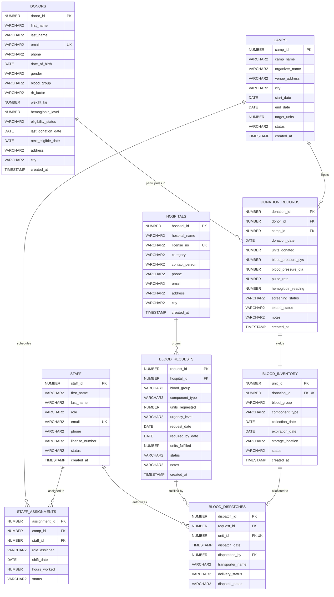

# LifeLine Connect: Entity-Relationship Diagram (ERD) & Relational Schema Specification

## 1. Conceptual & Logical ER Diagram (Crow's Foot Notation)

---

## 2. Normalization Analysis (Third Normal Form - 3NF)

1. **First Normal Form (1NF)**:
   - All attribute values are atomic (single scalar values).
   - No repeating groups or multivalued arrays.
   - Unique primary keys defined for all entities using Oracle identity sequences (`GENERATED ALWAYS AS IDENTITY`).

2. **Second Normal Form (2NF)**:
   - Meets 1NF.
   - All non-key attributes are fully functionally dependent on the entire primary key. In all tables, composite keys have been replaced or augmented with surrogate primary keys (`assignment_id`, `donation_id`, etc.), completely eliminating partial key dependencies.

3. **Third Normal Form (3NF)**:
   - Meets 2NF.
   - No transitive dependencies exist ($X \to Y$ and $Y \to Z$). 
   - Hospital data is separated from request data; camp venue details are separated from donation events; screening vitals belong to specific donation transactions; blood component parameters and expiration dates are decoupled from donor registration.

---

## 3. Referential Integrity & Business Rules
- **Donor Eligibility**: Hemoglobin must be $\ge 8.0\text{ g/dL}$ (clinical screening requires $\ge 12.0$ for passed status), weight $\ge 45\text{ kg}$, with standard status lifecycle.
- **First-Expired, First-Out (FEFO)**: Blood units track precise component shelf lives (RBC: 42 days, Platelets: 5 days, Whole Blood: 35 days, Plasma: 365 days).
- **Hospital Requisitions**: Strict priority grading (`CRITICAL_EMERGENCY`, `URGENT`, `NORMAL`) with dispatch linkage.
- **Audit & Performance**: Comprehensive B-Tree indexing on foreign keys and frequently filtered query dimensions (`blood_group`, `status`, `expiration_date`).
