# LifeLine Connect: Enterprise Entity-Relationship Diagram (ERD) & Relational Schema Specification

> **System**: LifeLine Connect — National Blood Transfusion Service (NBTS) Management Platform  
> **Database Engines**: Oracle Database 21c Express Edition (ACID Relational Core) & MongoDB 8.0 (NoSQL Unstructured Store)  
> **Architecture Pattern**: Polyglot Persistence with Hybrid Cross-Database Linkage  
> **Normalization Standard**: Fully Normalized to Third Normal Form (3NF / BCNF Compliant)

---

## 1. Interactive & Copy-Paste Prompts for Gemini

If you want to feed this schema into Google Gemini (or any AI assistant) to generate diagrams, test data, or visual code, use the following prompts:

### 📋 Prompt Option A: "Generate Visual Draw.io XML or PlantUML Diagram"
```text
I have a complete 3NF database schema specification for a National Blood Bank Management System called "LifeLine Connect" (Oracle 21c + MongoDB).
Below is the complete entity dictionary, cardinality matrix, and Mermaid/DBML code.
Please convert this specification into a draw.io compatible XML diagram / PlantUML diagram with color-coded entity categories (Donors, Inventory, Camps, Hospitals, Logistics) and clear Crow's Foot cardinality notations.
[PASTE THIS ENTIRE .MD FILE HERE]
```

### 📋 Prompt Option B: "Generate Professional Diagram Image / Mermaid Visualization"
```text
Act as a Principal Database Architect. Based on the following Entity-Relationship Specification for LifeLine Connect, produce:
1. A refined, publication-quality Mermaid ER diagram with visual group styling.
2. A high-level description of all primary keys, foreign keys, and cascading delete rules.
3. An explanation of how the Oracle relational tables link to the MongoDB document collections.
[PASTE THIS ENTIRE .MD FILE HERE]
```

---

## 2. Mermaid Entity-Relationship Diagram (Crow's Foot Notation)

```mermaid
erDiagram
    %% ==========================================
    %% ORACLE 21c RELATIONAL ENTITIES & RELATIONS
    %% ==========================================

    DONORS ||--o{ DONATION_RECORDS : "undergoes (1:N)"
    CAMPS ||--o{ DONATION_RECORDS : "hosts (1:N)"
    CAMPS ||--o{ STAFF_ASSIGNMENTS : "schedules (1:N)"
    STAFF ||--o{ STAFF_ASSIGNMENTS : "deployed to (1:N)"
    STAFF ||--o{ BLOOD_DISPATCHES : "authorizes release (1:N)"
    DONATION_RECORDS ||--|| BLOOD_INVENTORY : "yields unit (1:1)"
    HOSPITALS ||--o{ BLOOD_REQUESTS : "issues order (1:N)"
    BLOOD_REQUESTS ||--o{ BLOOD_DISPATCHES : "fulfilled through (1:N)"
    BLOOD_INVENTORY ||--o| BLOOD_DISPATCHES : "allocated to (1:1)"

    DONORS {
        NUMBER donor_id PK "Identity sequence (1001+)"
        VARCHAR2 first_name "Given name (NOT NULL)"
        VARCHAR2 last_name "Surname (NOT NULL)"
        VARCHAR2 email UK "Unique contact email"
        VARCHAR2 phone "Contact telephone"
        DATE date_of_birth "Birth date (Age >= 18)"
        VARCHAR2 gender "MALE | FEMALE | OTHER"
        VARCHAR2 blood_group "A+ | A- | B+ | B- | AB+ | AB- | O+ | O-"
        VARCHAR2 rh_factor "POSITIVE | NEGATIVE"
        NUMBER weight_kg "Donor weight (>= 45.0 kg)"
        NUMBER hemoglobin_level "Hemoglobin level (>= 8.0 g/dL)"
        VARCHAR2 eligibility_status "ELIGIBLE | TEMPORARILY_DEFERRED | PERMANENTLY_INELIGIBLE"
        DATE last_donation_date "Timestamp of latest donation"
        DATE next_eligible_date "Calculated 90-day cooldown date"
        VARCHAR2 address "Street address"
        VARCHAR2 city "Metropolitan/Regional City"
        TIMESTAMP created_at "System audit registration timestamp"
    }

    CAMPS {
        NUMBER camp_id PK "Identity sequence (2001+)"
        VARCHAR2 camp_name "Camp/Venue designated title"
        VARCHAR2 organizer_name "Sponsoring civic organizer"
        VARCHAR2 venue_address "Physical hall/park address"
        VARCHAR2 city "Regional Municipality"
        DATE start_date "Commencement date"
        DATE end_date "Conclusion date (>= start_date)"
        NUMBER target_units "Target collection volume (> 0)"
        VARCHAR2 status "UPCOMING | ACTIVE | COMPLETED | CANCELLED"
        TIMESTAMP created_at "Creation timestamp"
    }

    STAFF {
        NUMBER staff_id PK "Identity sequence (3001+)"
        VARCHAR2 first_name "Staff given name"
        VARCHAR2 last_name "Staff surname"
        VARCHAR2 role "DOCTOR | NURSE | PHLEBOTOMIST | COORDINATOR | VOLUNTEER"
        VARCHAR2 email UK "Official clinical email"
        VARCHAR2 phone "Emergency contact telephone"
        VARCHAR2 license_number "SLMC Medical Board License"
        VARCHAR2 status "ACTIVE | ON_LEAVE | INACTIVE"
        TIMESTAMP created_at "Record creation timestamp"
    }

    STAFF_ASSIGNMENTS {
        NUMBER assignment_id PK "Identity sequence (4001+)"
        NUMBER camp_id FK "References CAMPS(camp_id)"
        NUMBER staff_id FK "References STAFF(staff_id)"
        VARCHAR2 role_assigned "Designated shift responsibility"
        DATE shift_date "Date of assigned shift"
        NUMBER hours_worked "Standard shift hours (default 8.0)"
        VARCHAR2 status "SCHEDULED | ATTENDED | ABSENT"
    }

    DONATION_RECORDS {
        NUMBER donation_id PK "Identity sequence (5001+)"
        NUMBER donor_id FK "References DONORS(donor_id)"
        NUMBER camp_id FK "References CAMPS(camp_id) NULL=Central Bank"
        DATE donation_date "Collection transaction date"
        NUMBER units_donated "Volume collected (units, default 1.0)"
        NUMBER blood_pressure_sys "Systolic BP (80-200 mmHg)"
        NUMBER blood_pressure_dia "Diastolic BP (50-130 mmHg)"
        NUMBER pulse_rate "Heart rate (40-160 bpm)"
        NUMBER hemoglobin_reading "Vitals reading (>= 8.0 g/dL)"
        VARCHAR2 screening_status "PASSED | REJECTED"
        VARCHAR2 tested_status "PENDING | PASSED | REJECTED"
        VARCHAR2 notes "Clinical intake observations"
        TIMESTAMP created_at "Audit record creation"
    }

    BLOOD_INVENTORY {
        NUMBER unit_id PK "Identity sequence (6001+)"
        NUMBER donation_id FK,UK "1:1 link to verified DONATION_RECORDS"
        VARCHAR2 blood_group "A+ | A- | B+ | B- | AB+ | AB- | O+ | O-"
        VARCHAR2 component_type "WHOLE_BLOOD | RBC | PLATELETS | PLASMA"
        DATE collection_date "Physical extraction date"
        DATE expiration_date "Shelf-life expiry (FEFO criterion)"
        VARCHAR2 storage_location "Cryo-vessel/Chamber identifier"
        VARCHAR2 status "AVAILABLE | RESERVED | TRANSFUSED | DISCARDED | EXPIRED"
        TIMESTAMP created_at "Inventory entry timestamp"
    }

    HOSPITALS {
        NUMBER hospital_id PK "Identity sequence (7001+)"
        VARCHAR2 hospital_name "Clinical healthcare facility name"
        VARCHAR2 license_no UK "Health Ministry facility license"
        VARCHAR2 category "GOVERNMENT | PRIVATE | TRAUMA_CENTER | SPECIALTY_CLINIC"
        VARCHAR2 contact_person "Chief medical liaison"
        VARCHAR2 phone "24/7 Transfusion department phone"
        VARCHAR2 email "Official hospital orders email"
        VARCHAR2 address "Hospital physical campus address"
        VARCHAR2 city "Administrative city"
        TIMESTAMP created_at "Registration timestamp"
    }

    BLOOD_REQUESTS {
        NUMBER request_id PK "Identity sequence (8001+)"
        NUMBER hospital_id FK "References HOSPITALS(hospital_id)"
        VARCHAR2 blood_group "Requested ABO/Rh blood group"
        VARCHAR2 component_type "WHOLE_BLOOD | RBC | PLATELETS | PLASMA"
        NUMBER units_requested "Requested volume (> 0)"
        VARCHAR2 urgency_level "NORMAL | URGENT | CRITICAL_EMERGENCY"
        DATE request_date "Submission date"
        DATE required_by_date "Required delivery deadline"
        NUMBER units_fulfilled "Units allocated to date"
        VARCHAR2 status "PENDING | PARTIAL | APPROVED | DISPATCHED | REJECTED | CANCELLED"
        VARCHAR2 notes "Patient case & trauma diagnosis"
        TIMESTAMP created_at "Request submission timestamp"
    }

    BLOOD_DISPATCHES {
        NUMBER dispatch_id PK "Identity sequence (9001+)"
        NUMBER request_id FK "References BLOOD_REQUESTS(request_id)"
        NUMBER unit_id FK,UK "References BLOOD_INVENTORY(unit_id)"
        TIMESTAMP dispatch_date "Courier release timestamp"
        NUMBER dispatched_by FK "References STAFF(staff_id)"
        VARCHAR2 transporter_name "Cold-chain logistics courier"
        VARCHAR2 delivery_status "IN_TRANSIT | DELIVERED | RETURNED"
        VARCHAR2 dispatch_notes "Waybill & temperature logger notes"
    }

    %% ==========================================
    %% MONGODB 8.0 HYBRID DOCUMENT COLLECTIONS
    %% ==========================================

    CAMPS ||--o{ CAMP_FEEDBACK : "reviews (camp_id)"
    CAMPS ||--o{ CAMPAIGN_PROMOTIONS : "guidelines (camp_id)"
    DONORS ||--o{ DONOR_AUDIT_LOGS : "logs (donor_id)"

    CAMP_FEEDBACK {
        ObjectId _id PK "MongoDB Document ObjectID"
        NUMBER camp_id "Hybrid FK linking to Oracle CAMPS(camp_id)"
        NUMBER donor_id "Optional donor identity"
        STRING donor_name "Reviewer display name"
        STRING blood_group "Donor blood group"
        OBJECT ratings "overall_score, staff_friendliness, hygiene"
        STRING feedback_text "Qualitative donor feedback"
        BOOLEAN recommend_to_others "True / False endorsement"
        ISODate submitted_at "Submission timestamp"
    }

    CAMPAIGN_PROMOTIONS {
        ObjectId _id PK "MongoDB Document ObjectID"
        NUMBER camp_id "Hybrid FK linking to Oracle CAMPS(camp_id)"
        STRING media_type "POSTER | VIDEO | BROCHURE | SOCIAL_BANNER"
        STRING title "Promotional campaign title"
        STRING campaign_theme "Community awareness theme"
        OBJECT guidelines "Pre-donation dietary & sleep guidelines"
        ARRAY tags "Searchable campaign metadata tags"
    }

    EMERGENCY_APPEALS {
        ObjectId _id PK "MongoDB Document ObjectID"
        STRING appeal_code UK "Broadcast code (e.g. SOS-O-NEG-01)"
        NUMBER hospital_id "Hybrid FK linking to Oracle HOSPITALS(hospital_id)"
        STRING blood_group "Demanded blood group (e.g. O-)"
        STRING component_type "RBC | PLATELETS | WHOLE_BLOOD"
        NUMBER units_demanded "Target donor summons"
        STRING urgency_level "CRITICAL | STAT | URGENT"
        STRING clinical_context "Mass casualty triage / surgery case"
        ARRAY summoned_donors "Array of notified donor contact records"
        STRING status "ACTIVE | FULFILLED | EXPIRED"
        ISODate broadcast_time "Transmission timestamp"
    }

    DONOR_AUDIT_LOGS {
        ObjectId _id PK "MongoDB Document ObjectID"
        NUMBER donor_id "Hybrid FK linking to Oracle DONORS(donor_id)"
        STRING event_type "ELIGIBILITY_CALCULATION | AI_SUMMON | PROFILE_UPDATE"
        OBJECT event_payload "Complete immutable JSON snapshot of event"
        STRING performed_by "System Actor (ADMIN | SYSTEM_DAEMON | DONOR)"
        ISODate timestamp "Log entry timestamp"
    }
```



---

## 3. Database Markup Language (DBML) Schema for dbdiagram.io

Copy and paste this snippet directly into **[dbdiagram.io](https://dbdiagram.io)**:

```dbml
// LifeLine Connect DBML Schema Specification (Oracle 21c Core)

Table DONORS {
  donor_id int [pk, increment, note: 'Start with 1001']
  first_name varchar(50) [not null]
  last_name varchar(50) [not null]
  email varchar(100) [unique, not null]
  phone varchar(20) [not null]
  date_of_birth date [not null]
  gender varchar(10) [not null, note: 'MALE, FEMALE, OTHER']
  blood_group varchar(5) [not null, note: 'A+, A-, B+, B-, AB+, AB-, O+, O-']
  rh_factor varchar(10) [not null, note: 'POSITIVE, NEGATIVE']
  weight_kg decimal(5,2) [not null, note: '>= 45.0 kg']
  hemoglobin_level decimal(4,2) [not null, note: '>= 8.0 g/dL']
  eligibility_status varchar(30) [not null, default: 'ELIGIBLE']
  last_donation_date date
  next_eligible_date date
  address varchar(200)
  city varchar(50) [not null]
  created_at timestamp [not null, default: `CURRENT_TIMESTAMP`]

  indexes {
    (blood_group, eligibility_status) [name: 'idx_donor_bg']
    city [name: 'idx_donor_city']
  }
}

Table CAMPS {
  camp_id int [pk, increment, note: 'Start with 2001']
  camp_name varchar(100) [not null]
  organizer_name varchar(100) [not null]
  venue_address varchar(200) [not null]
  city varchar(50) [not null]
  start_date date [not null]
  end_date date [not null]
  target_units int [not null, default: 50]
  status varchar(20) [not null, default: 'UPCOMING']
  created_at timestamp [not null, default: `CURRENT_TIMESTAMP`]

  indexes {
    (status, start_date) [name: 'idx_camp_status_date']
  }
}

Table STAFF {
  staff_id int [pk, increment, note: 'Start with 3001']
  first_name varchar(50) [not null]
  last_name varchar(50) [not null]
  role varchar(30) [not null, note: 'DOCTOR, NURSE, PHLEBOTOMIST, COORDINATOR, VOLUNTEER']
  email varchar(100) [unique, not null]
  phone varchar(20) [not null]
  license_number varchar(50)
  status varchar(20) [not null, default: 'ACTIVE']
  created_at timestamp [not null, default: `CURRENT_TIMESTAMP`]
}

Table STAFF_ASSIGNMENTS {
  assignment_id int [pk, increment, note: 'Start with 4001']
  camp_id int [not null, ref: > CAMPS.camp_id]
  staff_id int [not null, ref: > STAFF.staff_id]
  role_assigned varchar(30) [not null]
  shift_date date [not null]
  hours_worked decimal(4,2) [not null, default: 8.0]
  status varchar(20) [not null, default: 'SCHEDULED']

  indexes {
    (staff_id, camp_id, shift_date) [unique]
    camp_id [name: 'idx_assign_camp']
    staff_id [name: 'idx_assign_staff']
  }
}

Table DONATION_RECORDS {
  donation_id int [pk, increment, note: 'Start with 5001']
  donor_id int [not null, ref: > DONORS.donor_id]
  camp_id int [ref: > CAMPS.camp_id, note: 'NULL if donated at central blood bank']
  donation_date date [not null, default: `SYSDATE`]
  units_donated decimal(3,1) [not null, default: 1.0]
  blood_pressure_sys int [not null, note: '80 - 200 mmHg']
  blood_pressure_dia int [not null, note: '50 - 130 mmHg']
  pulse_rate int [not null, note: '40 - 160 bpm']
  hemoglobin_reading decimal(4,2) [not null, note: '>= 8.0 g/dL']
  screening_status varchar(20) [not null, default: 'PASSED']
  tested_status varchar(20) [not null, default: 'PENDING']
  notes varchar(300)
  created_at timestamp [not null, default: `CURRENT_TIMESTAMP`]

  indexes {
    donor_id [name: 'idx_donation_donor']
    camp_id [name: 'idx_donation_camp']
  }
}

Table BLOOD_INVENTORY {
  unit_id int [pk, increment, note: 'Start with 6001']
  donation_id int [unique, not null, ref: - DONATION_RECORDS.donation_id]
  blood_group varchar(5) [not null]
  component_type varchar(20) [not null, default: 'WHOLE_BLOOD']
  collection_date date [not null]
  expiration_date date [not null]
  storage_location varchar(50) [not null]
  status varchar(20) [not null, default: 'AVAILABLE']
  created_at timestamp [not null, default: `CURRENT_TIMESTAMP`]

  indexes {
    (blood_group, status, expiration_date) [name: 'idx_inv_fefo']
    (component_type, status) [name: 'idx_inv_component']
  }
}

Table HOSPITALS {
  hospital_id int [pk, increment, note: 'Start with 7001']
  hospital_name varchar(100) [not null]
  license_no varchar(50) [unique, not null]
  category varchar(30) [not null, default: 'GOVERNMENT']
  contact_person varchar(100) [not null]
  phone varchar(20) [not null]
  email varchar(100) [not null]
  address varchar(200) [not null]
  city varchar(50) [not null]
  created_at timestamp [not null, default: `CURRENT_TIMESTAMP`]
}

Table BLOOD_REQUESTS {
  request_id int [pk, increment, note: 'Start with 8001']
  hospital_id int [not null, ref: > HOSPITALS.hospital_id]
  blood_group varchar(5) [not null]
  component_type varchar(20) [not null, default: 'WHOLE_BLOOD']
  units_requested int [not null]
  urgency_level varchar(25) [not null, default: 'NORMAL']
  request_date date [not null, default: `SYSDATE`]
  required_by_date date [not null]
  units_fulfilled int [not null, default: 0]
  status varchar(20) [not null, default: 'PENDING']
  notes varchar(300)
  created_at timestamp [not null, default: `CURRENT_TIMESTAMP`]

  indexes {
    hospital_id [name: 'idx_req_hosp']
    (status, urgency_level) [name: 'idx_req_status_urg']
  }
}

Table BLOOD_DISPATCHES {
  dispatch_id int [pk, increment, note: 'Start with 9001']
  request_id int [not null, ref: > BLOOD_REQUESTS.request_id]
  unit_id int [unique, not null, ref: - BLOOD_INVENTORY.unit_id]
  dispatch_date timestamp [not null, default: `CURRENT_TIMESTAMP`]
  dispatched_by int [ref: > STAFF.staff_id]
  transporter_name varchar(100)
  delivery_status varchar(20) [not null, default: 'IN_TRANSIT']
  dispatch_notes varchar(300)

  indexes {
    request_id [name: 'idx_disp_req']
  }
}
```

---

## 4. Entity Dictionary & Cardinality Rules

| Parent Entity | Child Entity | Relationship / Cardinality | Foreign Key Column | Delete Rule | Business Logic Description |
| :--- | :--- | :--- | :--- | :--- | :--- |
| **DONORS** | `DONATION_RECORDS` | **1 : Many ($1 : N$)** | `donor_id` | `RESTRICT` | A registered donor can perform multiple donations over their lifetime with 90-day cooldowns. |
| **CAMPS** | `DONATION_RECORDS` | **1 : Many ($1 : N$)** | `camp_id` | `SET NULL` | A camp hosts many donation events. Central blood bank walk-ins have `camp_id = NULL`. |
| **CAMPS** | `STAFF_ASSIGNMENTS` | **1 : Many ($1 : N$)** | `camp_id` | `CASCADE` | A camp schedules doctors, nurses, and phlebotomists across specific drive shifts. |
| **STAFF** | `STAFF_ASSIGNMENTS` | **1 : Many ($1 : N$)** | `staff_id` | `CASCADE` | A staff member can be assigned to shifts at various mobile camps. |
| **STAFF** | `BLOOD_DISPATCHES` | **1 : Many ($1 : N$)** | `dispatched_by` | `SET NULL` | A qualified clinical officer or coordinator authorizes physical unit dispatch. |
| **DONATION_RECORDS** | `BLOOD_INVENTORY` | **1 : One ($1 : 1$)** | `donation_id` | `CASCADE` | Each approved blood donation transaction produces exactly one barcode-tracked inventory unit. |
| **HOSPITALS** | `BLOOD_REQUESTS` | **1 : Many ($1 : N$)** | `hospital_id` | `CASCADE` | An accredited hospital issues multiple requisition demand orders. |
| **BLOOD_REQUESTS** | `BLOOD_DISPATCHES` | **1 : Many ($1 : N$)** | `request_id` | `CASCADE` | A single multi-unit blood order is fulfilled through one or more physical unit dispatches. |
| **BLOOD_INVENTORY** | `BLOOD_DISPATCHES` | **1 : One ($1 : 1$)** | `unit_id` | `RESTRICT` | A distinct physical blood unit can only be dispatched once (enforced by `UNIQUE` constraint). |

---

## 5. Polyglot Cross-Database Linkage (Oracle $\leftrightarrow$ MongoDB)

| MongoDB Collection | Linking Attribute | Target Oracle Relational Entity | Purpose in Architecture |
| :--- | :--- | :--- | :--- |
| `camp_feedback` | `camp_id` | `CAMPS.camp_id` | Stores unstructured donor survey ratings, review comments, and cleanliness scores for MongoDB Aggregation Pipeline analytics. |
| `campaign_promotions` | `camp_id` | `CAMPS.camp_id` | Stores rich promotional flyers, multi-language pre-donation guidelines, and digital media attachments. |
| `emergency_appeals` | `hospital_id` | `HOSPITALS.hospital_id` | Real-time broadcast alerts for critical blood deficits, matching compatible donor geofences without polluting Oracle transaction logs. |
| `donor_audit_logs` | `donor_id` | `DONORS.donor_id` | Immutable JSON audit ledger recording automated eligibility evaluations, AI smart summons, and security events. |

---

## 6. Normalization Proof (3NF / BCNF Compliance)

1. **First Normal Form (1NF)**:
   - All attribute columns contain atomic, non-divisible scalar values.
   - Repeating multi-valued attributes (e.g. medical staff assigned to a camp) are isolated into dedicated associative tables (`STAFF_ASSIGNMENTS`).
   - Explicit primary keys are enforced on every table via Oracle Identity Columns.
2. **Second Normal Form (2NF)**:
   - Meets 1NF.
   - No partial dependencies exist: in all composite associative tables, surrogate primary keys (`assignment_id`, `dispatch_id`) are utilized, ensuring all non-key attributes depend on the complete primary key.
3. **Third Normal Form (3NF)**:
   - Meets 2NF.
   - No transitive functional dependencies ($X \to Y \to Z$). Hospital addresses depend on `hospital_id`, not on `request_id`. Screening vitals depend on `donation_id`, not on `donor_id`. Shelf-life expiration dates are computed strictly per `unit_id`.
4. **Boyce-Codd Normal Form (BCNF)**:
   - Every determinant is a candidate key.
